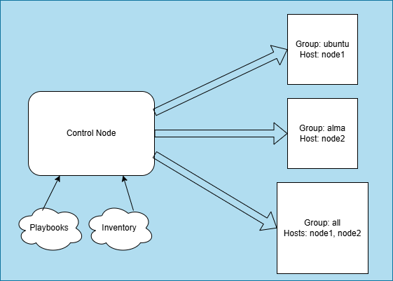

# Ansible Lab

## Steps

1. vagrant up
2. vagrant ssh control
3. ssh-keygen -t rsa -b 4096 -N "" -f ~/.ssh/id_rsa
4. cp ~/.ssh/id_rsa.pub /vagrant/control_key.pub
5. exit
6. vagrant ssh node1
7. mkdir -p ~/.ssh
8. cat /vagrant/control_key.pub >> ~/.ssh/authorized_keys
9. chmod 700 ~/.ssh && chmod 600 ~/.ssh/authorized_keys
10. exit
11. vagrant ssh node2
12. mkdir -p ~/.ssh
13. cat /vagrant/control_key.pub >> ~/.ssh/authorized_keys
14. chmod 700 ~/.ssh && chmod 600 ~/.ssh/authorized_keys
15. exit
16. vagrant ssh control
17. vim inventory.ini
18. ansible all -i inventory.ini -m ping
